<p align="center">
  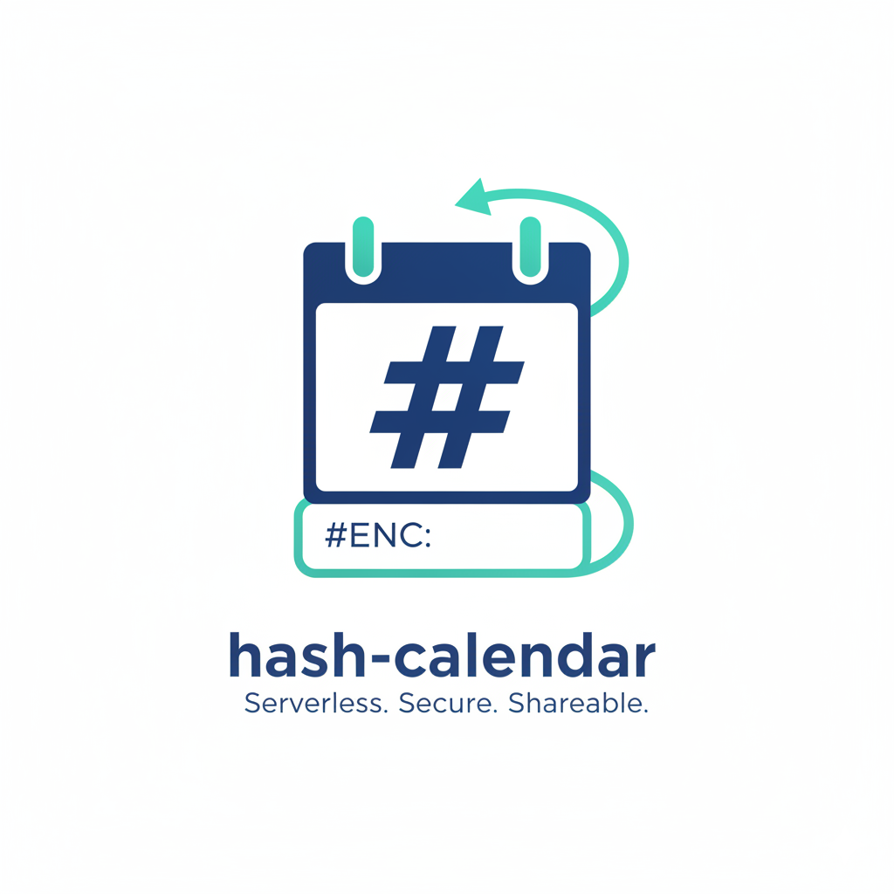
</p>

# hash-calendar

hash-calendar is a lightweight, privacy-first, client-only calendar. Your calendar state lives entirely in the URL hash, so sharing is as simple as copying the link. No backend, no accounts.

Live site: https://hash-calendar.netlify.app/
GitHub: https://github.com/supunlakmal/hash-calendar

## Features

- URL hash storage with LZ-String compression
- Optional password lock with AES-GCM + PBKDF2 (150k SHA-256) encryption
- Day, week, month, year, and agenda views
- Focus mode dashboard with live countdown and "up next" list
- "Up Next" countdown widget for the next event
- Create, edit, and delete events
- All-day events and duration-based events
- Recurring events (daily, weekly, monthly, yearly)
- Event color palette and editable calendar title (saved in the URL)
- Copy-link sharing and QR sharing (with length guard)
- View or copy JSON and URL hash
- Export calendar to JSON
- Import events from .ics files
- World clock sidebar with saved timezones
- Theme toggle (light/dark)
- Week start toggle (Sunday/Monday)
- URL length meter with warnings

## Screenshots

<table>
  <tr>
    <td>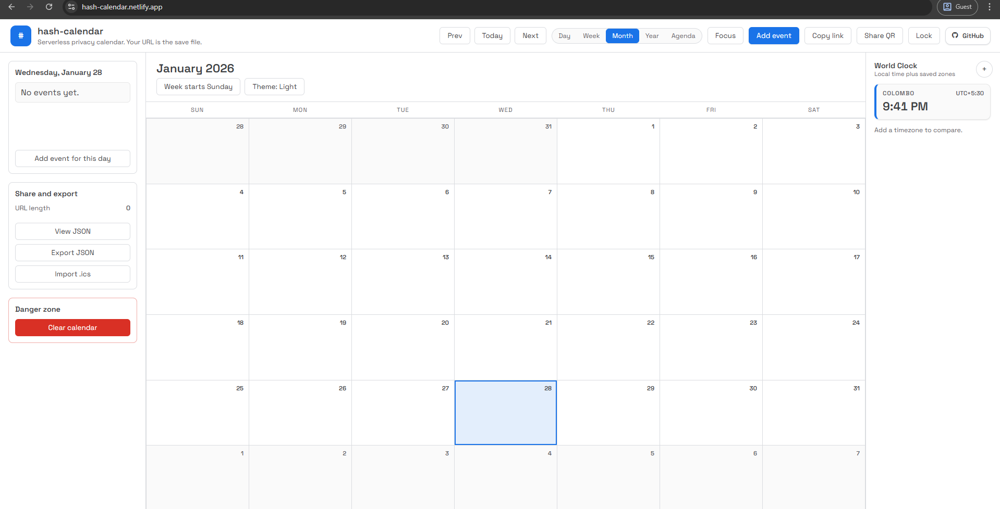</td>
    <td>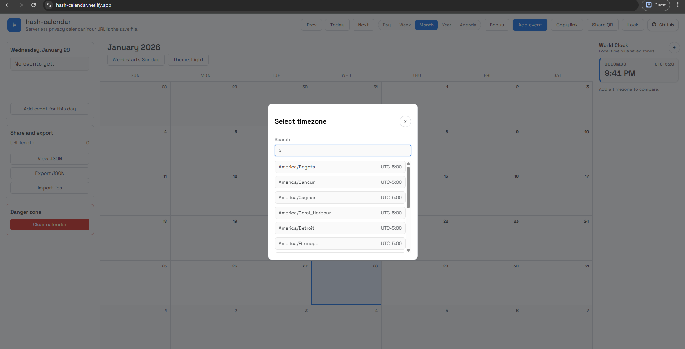</td>
  </tr>
  <tr>
    <td>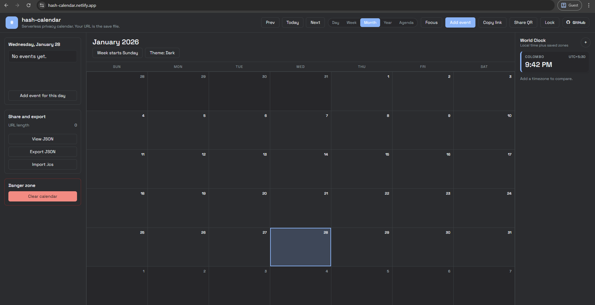</td>
    <td></td>
  </tr>
  <tr>
    <td>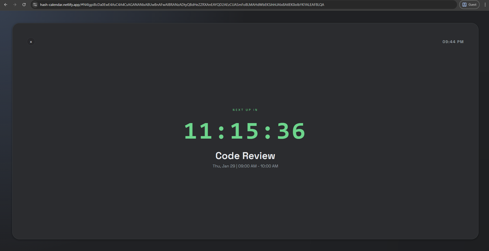</td>
    <td>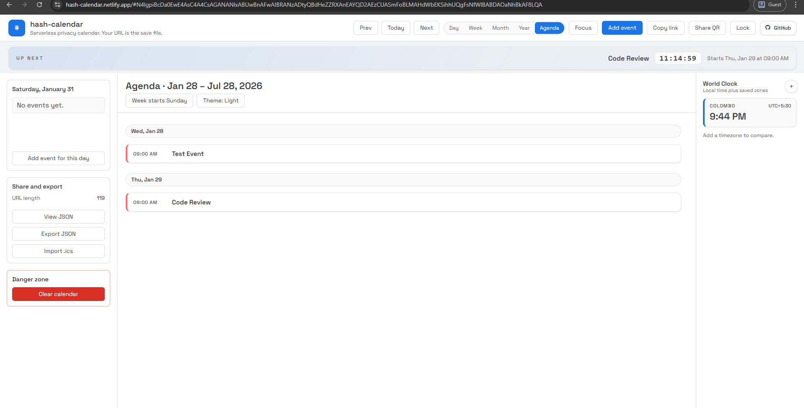</td>
  </tr>
  <tr>
    <td>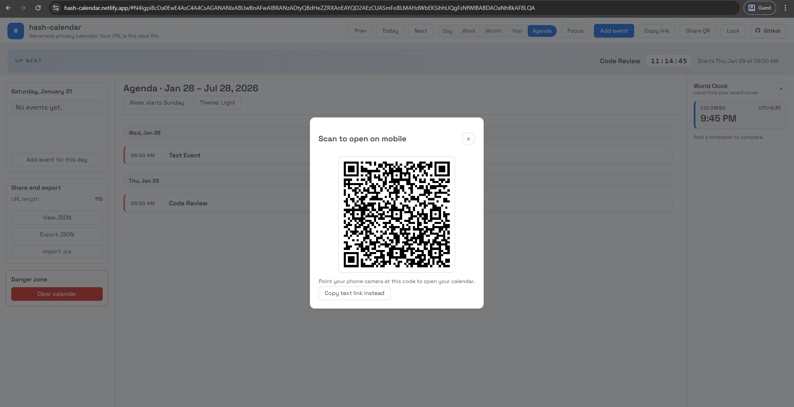</td>
    <td>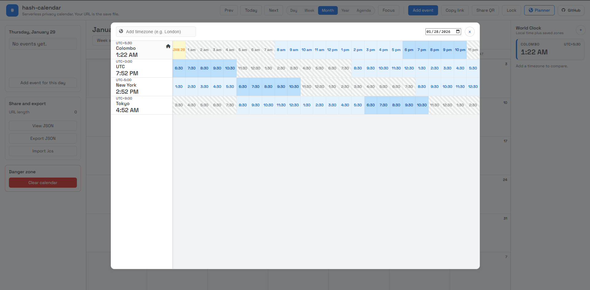</td>
  </tr>
  <tr>
    <td>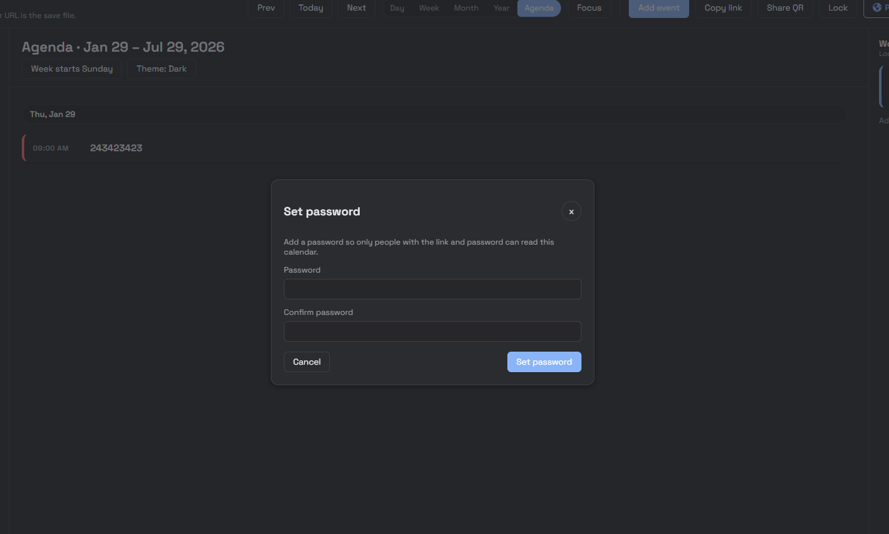</td>
    <td>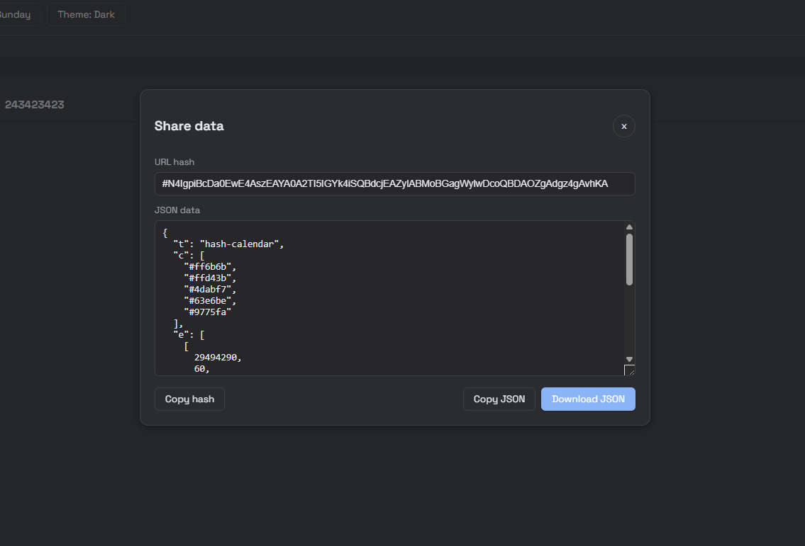</td>
  </tr>
  <tr>
    <td>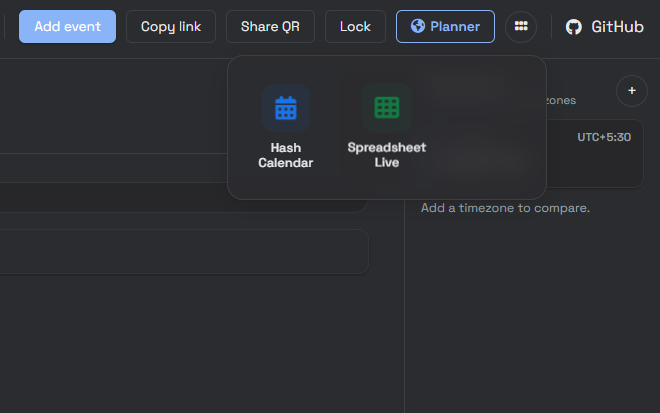</td>
    <td></td>
  </tr>
</table>

## How it works

- The calendar state is serialized to JSON and compressed into the URL hash.
- If a password is set, the compressed payload is encrypted using AES-GCM with PBKDF2 key derivation.
- No data leaves the browser unless you share the link.

Encrypted links start with `#ENC:`. Clearing the hash resets the calendar.

## URL hash payload (full schema + example)

The URL hash stores a compressed JSON payload (LZ-String). The JSON below is the compact form **before** compression. (This section intentionally excludes encrypted payloads.)

```json
{
  "t": "Acme Schedule",
  "c": { "1": "2ecc71", "3": "e74c3c" },
  "e": [
    [28930080, 30, "Daily standup", 1, "d"],
    [28930200, 0, "Launch day", 3],
    [28930800, 90, "Design review"]
  ],
  "s": { "d": 1, "m": 1, "v": "week" },
  "z": ["America/New_York", "Europe/London"],
  "mp": {
    "h": "America/Los_Angeles",
    "z": ["UTC", "Asia/Tokyo"],
    "s": 1769721600000,
    "d": "2026-01-30",
    "f24": 1
  }
}
```

Key meanings:

- `t`: Calendar title (string).
- `c`: Colors.
  - **Compact form (most common):** an object of palette overrides by index (keys `"0"`, `"1"`, ...), values are hex colors **without** the `#`.
  - **Expanded form (also accepted):** an array of hex colors (with or without `#`).
- `e`: Events array. Each event entry is a compact array:
  - `[startMin, duration, title]` is the minimum shape.
  - Optional `colorIndex` and `rule` follow: `[startMin, duration, title, colorIndex, rule]`.
  - `startMin` is minutes since Unix epoch (`Math.floor(date.getTime() / 60000)`).
  - `duration` is minutes; `0` means an all-day event.
  - `colorIndex` points into the palette (defaults to `0`).
  - `rule` is recurrence: `d` (daily), `w` (weekly), `m` (monthly), `y` (yearly).
- `s`: Settings object:
  - `d`: Theme (`1` = dark, `0` = light).
  - `m`: Week start (`1` = Monday, `0` = Sunday).
  - `v`: Last view (`day`, `week`, `month`, `year`, `agenda`).
- `z`: Saved world-clock timezones (IANA strings).
- `mp`: World planner state (optional):
  - `h`: Home timezone (IANA string).
  - `z`: Extra timezones to compare (IANA strings).
  - `s`: Selected scrubber timestamp (milliseconds since Unix epoch).
  - `d`: Planner date (YYYY-MM-DD string).
  - `f24`: Time format (`1` = 24h, `0` = 12h).

## Getting started

Open `index.html` in your browser.

For clipboard and file import features, run a local server:

```bash
npx serve .
```

## Project structure

- `index.html` - UI markup and modals
- `styles.css` - Styles
- `script.js` - App logic and state
- `modules/`
  - `calendarRender.js` - Month, week, day, and year grids
  - `agendaRender.js` - Agenda list view
  - `recurrenceEngine.js` - Recurring event expansion
  - `countdownManager.js` - Up next countdown widget
  - `focusMode.js` - Focus mode overlay
  - `timezoneManager.js` - World clock helpers
  - `qrCodeManager.js` - QR sharing
  - `icsImporter.js` - .ics parsing
  - `hashcalUrlManager.js` - URL read/write + compression
  - `cryptoManager.js` - Encryption helpers
  - `lz-string.min.js` - Compression library
- `demo/` - Screenshot assets

## License

MIT. See `LICENSE`.
